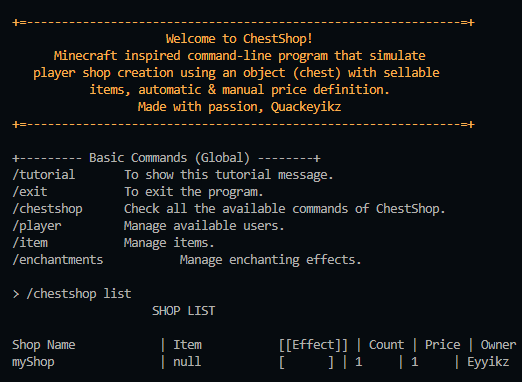
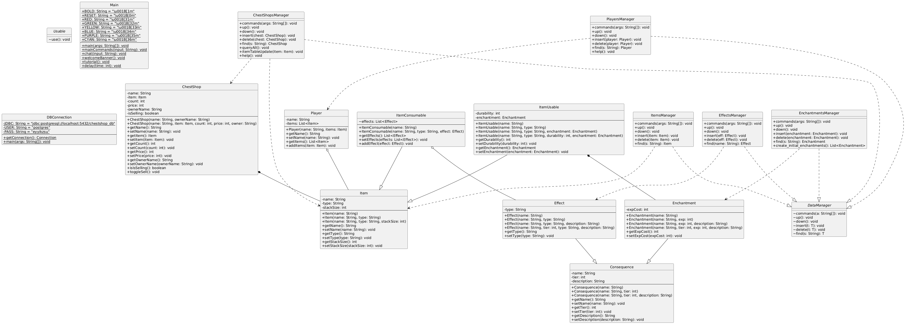

# ChestShop

**Disclaimer:** The program is still in development, so it won't be finished at demo-day. I apologize.  

**TL:DR** Unga Bunga
- "ChestShop" contains items, it sells them. One ChestShop, one item.
- "Item" has three forms, but all have names, some even have Enchantment or Effect.
- "Player" is actor, they have money, they buy, they keep the items.

## Flow
1. Run the program
2. /chestshop up
3. /item up
4. /chestshop create [shopName] [Item] [count] [price] [owner]
5. /chestshop list

## Class List

![UML](http://www.plantuml.com/plantuml/uml/jLXRRzis57xtho3ovCnsapRj7eJDQEmOGmQtCM8RHT4D0IqnDXU9KaLgdTirlxsaI8bNnIc2l1WWptSEp_buBfJVKWPBLcLfZzvXKi0IPY1E8QNdZ9LuKp5q6UTaYRyYSDhRuGI169TnYdgz6WMcEqJPSfSNu5iFW1616Oh0agkIhLXZXh88NF9ViOhpYh08OCB4gYXnZDfL_eMWyhshJfSeJVaY0fiyJn4aOdV4VmRjmNtpp27mx1m_XDR-3O7sRWYqRygYPMsBc3YXVspuEg1gqpo00_xDSQ9qn352Hz4XDEejxOIDdmg7X8AaIE3bblRKLbW8hsq5kQN3iHMk6hAyKBJ49rIRmFIokI5XGT_HWENRROg4hD_WlxSvanEAFbU8n2YSDGmBmbLY98Z69IuOpec9aKcWBTcyFoGSWjR-Ot534F3YAQcmufRjYwftj6CM-a8VxXraoa9EkkJFRczHp2JlR5yWZrC9yEaCx7E630kFGtLJ6LRLL_0uAu9S3lHugZSjTprcIBo3X6M8A7hGVyKqfxfXINeqAi1HXt08k2sTSOTX3x3KgMjGTTWCfsacmxFJiDaqOpUOuYjKta9Uk1UGmNUGm2qgQxRkuppB84be7pO7VVfRf_5zLVIDLSAxYhd6l0HBrkVdhKmKIX53xkuj9acV6jUuiZrRKxX9PMUvhoZo-u_ej1sDnoa8FXpZEp7yx1oekxPt-Tvke3mEO8R0Fl59BUQdga3gB9lJxQJGsuvx8MP5EwqoVGMeBcj-NtDCsM-ooCSMbLeZJ6g7tALE7XIf3jTckJnU1EGuKAUxaWQTDBY1IQBQatEAXdIccf6FewGguGQdcEtRZ4Awe2Ep1raKIHjXUWAoZimxYEGaTdZpCpQS80yO5VEjLR3ppjXtRDffQ_R4OvV4-feDGASp1wxo7SIaliJ1Dru53CVVmUHgVj643Nu7HtzLfwSl9vzUPaSMx7gsdAq2k5CF5x9svfhxutesUny2ldA07sVp-TM74FBCGKxcwra8zzh1BTRNYtaG-SP1JZ-U1ttyjSR9n6x16QUs3yij3KqE6pPjfWp_MAbOe8krQ7wnx33g2qhvu48JI8XyaNa8Lh6yn30D2lc4Wdl-RCiw6cBxtK7DMJdGix8hQ6jS3fnnEL3ZCXRM8ts8gI57vmC8Ruos827bx-5oVvvQKOllb9Me_dMHG6uy-DsoGsdX5y_5X3TnmXicVuV8JjXI-2UNcPdoJxA9euA_FRObef_JwEGapMEOxiHhvCthirSdTKoK-tcJR8uiK-lbxDeqrLYnKOlpvT94eVqUttsbLI0nwu-mncyHbLuzDe6TX_Upv06VIO61f58WBAnlttayI53mGVmyRX_kn4qCXv5UEZjJ82uHpzaRJ33ZnNnZM3JU1dfpRC_mPua_M3ygug3CYx7-9w5rTC5x4IgVnTMYDXsf8tntE-MUonBHtIcalFlVfEQD9aBNpqYf5VXpXoeId_YtZSwHvbpn99GI_wfuCFf_iLz68tbFwijxDFf_RFu5qZE_EpsXywAkvRKrH_3Y1HV8jvahoha3ghIDvwXjIMswLjIs2C4i9t-grOh69s4GCZP6J5XkyDHjsfEFc_123SjN3uB6Le1MoNiM7Aboswa-JykJZvjQK2cVDudo5f6aoj8V)

Alternative Image:

| Class Name | Package |
|---|---|
| Usable			| interfaces |
| DataManager		| interfaces |
| DBConnection      | manager |
| ItemsManager      | manager |
| PlayersManager	| manager |
| EffectsManager    | manager |
| ChestShopsManager | manager |
| Item              | item | 
| ItemUsable        | item |
| ItemConsumable	| item |
| Effect			| effect |
| Enchantment		| effect |
| ChestShop		    | chestshop |
| Player            | player |

### A Mind's Voice

I am still unsure what to make of this program, it has cool concept and everything. But in the end of the day, it's not very usable nor very useful for anyone, not even me. "Oh! I'm going to make my own tools with this program and i'll make sure it serves purpose in my life or other's life!". But yeah... It's not going to happen...

Honestly, I've been through a lot these several days. All that brilliant ideas is now obsolete, i could not realize that I, myself is incapable of doing this fully. So, after several troubles and tripping stone, I am back on track. Slowly, but surely.

~ Quackeyikz

## Credit
**Repository:** https://github.com/Quackeyikz/ChestShop_Java
Driver: https://jdbc.postgresql.org/